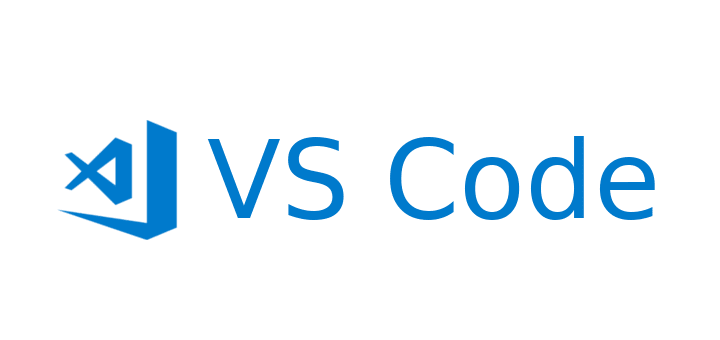

<!--Headings-->
# h1
## h2
### h3
#### h4
##### h5
###### 6

*italic*

**Strong**

***Both***

<!--UL-->
* apple
    * apple 2
* orange
* etc

1. apple
    1. apple 2
2. orange
3. etc
<!--Enlaces-->
[Youtube](www.youtube.com)

[Youtube](www.youtube.com "Youtube Channel")

> Quote

---
___

<!--Visualización de Código-->
`Hello World`

```java
if(num>1){
    num++;
}else{
    System.out.println("Hello World");
}

```
```html
<h1>Hello World</h1>
```

<!--Tables-->

|Table|Row|
|-----|---|

<!--Images-->




<!--Github-->
* [x] Task 1
* [] Task 2
* [] Task 3
